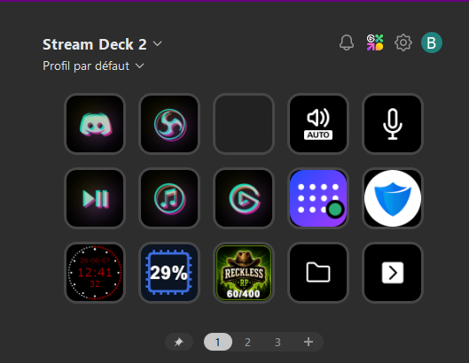

# Lathanor Reckless RP Status

Plugin Stream Deck permettant d'afficher en temps réel :

* Statut du serveur (Online / Offline)
* Nombre de joueurs connectés
* Mise à jour automatique toutes les 3 secondes
* Icônes personnalisées Reckless RP

## Aperçu



## Installation

1. Télécharger la dernière version depuis les Releases.
2. Extraire l'archive téléchargée.
3. Copier le dossier du plugin dans :

```text
%appdata%\Elgato\StreamDeck\Plugins\
```

4. Redémarrer Stream Deck.

## Téléchargement

Dernière version :

https://github.com/Lathanor-Dev/Lathanor-RecklessRP-Status-StreamDeck/releases/latest

## Informations

* Serveur : Reckless RP
* Server ID : 3yg6jzb
* Créateur : Lathanor

## Fonctionnement

Le plugin vérifie automatiquement l'état du serveur toutes les 3 secondes.

* Vert = serveur en ligne
* Rouge = serveur hors ligne
* Affichage du nombre de joueurs connectés

Compatible Stream Deck sous Windows.
